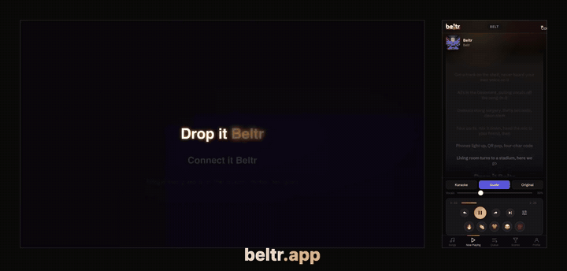

  

<h1 align="center">Beltr</h1>

<strong>Karaoke from the songs you already own.</strong>

  
  
  

---

  

Beltr turns music you already own into karaoke. It removes the vocals on your own computer with a local AI model, force-aligns the lyrics to the music word by word, puts them on your TV, and turns every phone in the room into a remote and a microphone. One-time purchase, no subscription, nothing uploaded.

This repository holds the **release artifacts and auto-update feed** for the desktop app, plus the public issue tracker and discussions. The source code is private.

## Current product information

Facts below are current as of **September 2026 (v1.63)** and are kept in step with [beltr.app](https://beltr.app). Release notes further down the page describe each version as it was on the day it shipped, so older notes may mention engines or prices Beltr no longer uses.

| | |
|---|---|
| **Latest version** | See [Releases](https://github.com/CasaVargas/beltr-releases/releases/latest) or the [changelog](https://beltr.app/changelog.html). |
| **Price** | **$19.99, one time.** No subscription. Lifetime updates included. One license covers two devices. 14-day money-back guarantee. There is no launch or introductory price, and $29.99 has never been the regular price. |
| **Free trial** | Five songs, no signup, no credit card, no time limit. |
| **What you buy** | The desktop app (macOS, Windows, Linux) or the self-hosted server. The phone and TV apps are free companions. |
| **Desktop platforms** | macOS 12+ on Apple Silicon (`.dmg`, signed and notarized), Windows 10/11 (`.exe` installer or the [Microsoft Store](https://apps.microsoft.com/detail/9NZF2JD02DS9)), Linux (`.AppImage` or `.deb`). |
| **Free companion apps** | Beltr Remote (remote + microphone with live pitch scoring, reactions and shout-outs) for [iPhone](https://apps.apple.com/us/app/beltr-remote-karaoke-mic/id6777520345) and [Android](https://play.google.com/store/apps/details?id=app.casavargas.beltr.remote). Beltr Client for [Apple TV](https://apps.apple.com/us/app/beltr-client/id6782151784) and [Android TV / Google TV](https://play.google.com/store/apps/details?id=app.casavargas.beltr.client): the lyrics screen, and since v1.63 your whole library browsable from the couch with voice search and an on-stage transport. Any phone browser also works by scanning the QR code on the TV. |
| **Self-hosted** | Docker images `ghcr.io/casavargas/beltr` (CPU, `linux/amd64` **and** `linux/arm64`: Apple Silicon Macs under Docker Desktop or OrbStack, Raspberry Pi 5, Ampere), `:latest-cuda` (NVIDIA) and `:latest-openvino` (Intel iGPU / Arc A-series), the GPU images `amd64` only. Unraid Community Applications: **Beltr**, **Beltr-NVIDIA** and **Beltr-Intel**. Templates, compose file and the full guide: [CasaVargas/beltr-unraid](https://github.com/CasaVargas/beltr-unraid) and [beltr.app/selfhost](https://beltr.app/selfhost). A TrueNAS community-train submission is open. |
| **Vocal separation** | UVR MDX-Net running on ONNX Runtime, entirely on your machine. Your audio is never uploaded. (Releases before v1.60.0 used Demucs v4.) Songs you have already split elsewhere, such as a StemDeck zip or a loose set of `song_vocals`, `song_drums`, … files, import directly and skip separation. |
| **Lyrics** | Beltr obtains synced lyrics (from LRCLIB, or lyrics you paste or import) and **force-aligns** them to the vocal track for word-level karaoke timing. When lyrics cannot be found, it can generate a draft transcription locally with an on-device speech model (Parakeet-TDT) before force-aligning the result. Whisper is not the alignment engine. Timings can be hand-edited word by word in the dashboard. |
| **Scoring** | Live pitch detection is **Standard** by default. A **Neural** detector (a small on-device model, about 4 MB, in beta) can be switched on under Settings → Party and tracks a voice more reliably in a noisy room. |
| **GPU** | Apple Silicon is accelerated out of the box. On Windows and Linux an optional GPU pack (Settings) accelerates separation: CUDA for NVIDIA, DirectML on Windows for AMD and Intel graphics where the driver supports it. Containers: CUDA and OpenVINO builds; AMD is not supported in the container. GPU affects separation only; everything also runs on the CPU. |
| **Karaoke formats** | CDG / MP3+G import and export, `.kar` and `.mid` MIDI karaoke (with your own `.sf2` sound banks), Thai NCN (`.mid` + `.lyr` + `.cur`), karaoke MP4/MKV, stem sets from StemDeck and other separators. |
| **Remote access** | A one-click Cloudflare tunnel from the desktop app, or a **Reverse proxy / my own address** mode if you already run nginx, Caddy, Traefik or Tailscale Serve. |
| **Offline** | Works offline after install, the one-time alignment-model download and a single license activation. Online lyrics lookup and music-video backgrounds are the only features that use the internet. |
| **Privacy** | No account, no telemetry, no analytics in the app. [Privacy policy](https://beltr.app/privacy). |

## How it works

1. **Add** a song from your own music files (MP3, FLAC, WAV), a stem set you already split, a CDG / MP3+G disc, a MIDI or `.kar` file, or a folder you point Beltr at (an exported iTunes / Music.app library works too).
2. **Prepare.** Beltr separates the vocals on your machine, fetches or drafts the lyrics, force-aligns them word by word, maps the pitch and reads the key. A minute or two per song on most computers; quicker on Apple Silicon or with a GPU. It opens with a song already prepared so you can sing before importing anything.
3. **Sing.** Lyrics on the TV with a pitch bar, live scoring, party games, a stem mixer and key change. Guests scan the QR code and their phone becomes the remote and the mic. With the free TV apps the whole library is browsable from the couch.

## Download

| Platform | Get it |
|----------|--------|
| **macOS** (Apple Silicon, 12+) | [`.dmg`](https://github.com/CasaVargas/beltr-releases/releases/latest) |
| **Windows** (10/11, 64-bit) | [`.exe`](https://github.com/CasaVargas/beltr-releases/releases/latest) or the [Microsoft Store](https://apps.microsoft.com/detail/9NZF2JD02DS9) |
| **Linux** (x86-64) | [`.AppImage` or `.deb`](https://github.com/CasaVargas/beltr-releases/releases/latest) |
| **Home server** | [Unraid Community Applications](https://unraid.net/community/apps?q=beltr) or [Docker](https://beltr.app/selfhost) (x86-64 and arm64) |

Try 5 songs free, then **$19.99 one time** at [beltr.app/buy](https://beltr.app/buy).

## System requirements

- **RAM:** 8 GB minimum, 16 GB recommended
- **CPU:** modern multi-core processor; Apple Silicon or a supported GPU is faster
- **Disk:** about 2 GB free for the app and the models it downloads on first use
- **OS:** macOS 12+ (Apple Silicon), Windows 10/11, Linux x86-64

## Installation notes

**macOS:** the build is signed and notarized by Apple; drag it to Applications and launch.

**Windows:** SmartScreen may show "Windows protected your PC" on a new release until the signature accrues reputation. Click **More info**, then **Run anyway**. The Microsoft Store build skips this entirely.

**Linux:** the AppImage needs `libfuse2` (`sudo apt install libfuse2` on Ubuntu 22.04+). The `.deb` installs through your package manager.

**Self-hosted:** phone microphones need HTTPS. Either use the free Beltr Remote app, which captures through the phone natively, or put Beltr behind your own reverse proxy with a certificate. The guide covers both.

## Features

- **Local AI vocal separation**: any song you own becomes a karaoke track, on your machine; stems you already have import as they are
- **Word-level synced lyrics**: fetched or supplied, then force-aligned to the vocal, with a word-timing editor for the stubborn ones
- **Multi-device**: TV shows the lyrics, phones join by QR code as remotes and microphones; free native apps for iPhone, Android, Apple TV and Android TV
- **Library on the TV**: the TV apps browse artists, albums and posters with voice search, and run the queue from the couch
- **Live scoring**: real-time pitch detection (Standard or Neural), the pitch bar, leaderboards, battle mode
- **Stem mixer and key change**: control every stem live; multi-stem imports get a slider per part
- **Practice mode, recording and clips**: rehearse with an on-screen transport, record a performance, share the clip from your phone
- **Party features**: queue, crowd reactions and shout-outs, party games, playlists and Auto-DJ, beat-driven visualizers, music-video backgrounds you can align by ear
- **Karaoke formats**: CDG / MP3+G in and out, MIDI / `.kar` with your own sound banks, Thai NCN, karaoke video, USB export for hardware machines
- **Big libraries**: connected folders and exported iTunes / Music.app libraries, tens of thousands of songs, a Not-prepared-yet view, duplicate healing
- **Self-hosted**: the same server as a container for Unraid, Docker and TrueNAS, on x86-64 and arm64
- **One-time purchase**: no subscription, lifetime updates, no account, no telemetry

## Support

- **Website:** [beltr.app](https://beltr.app) · **FAQ:** [beltr.app/faq](https://beltr.app/faq)
- **Email:** [support@beltr.app](mailto:support@beltr.app)
- **Discord:** [discord.gg/PYU9g6GsRq](https://discord.gg/PYU9g6GsRq)
- **Bug reports:** [GitHub Issues](https://github.com/CasaVargas/beltr-releases/issues)
- **Feature requests and questions:** [GitHub Discussions](https://github.com/CasaVargas/beltr-releases/discussions)
- **Refunds:** [14-day money-back guarantee](https://beltr.app/refund)

## License

Beltr is proprietary software from Casa Vargas LLC. Third-party components and their licenses are listed at [beltr.app/acknowledgments](https://beltr.app/acknowledgments) and under Settings → About → Acknowledgments in the app. Beltr was developed with the assistance of AI coding tools. All product decisions, testing, and final code are reviewed and directed by its developer.
